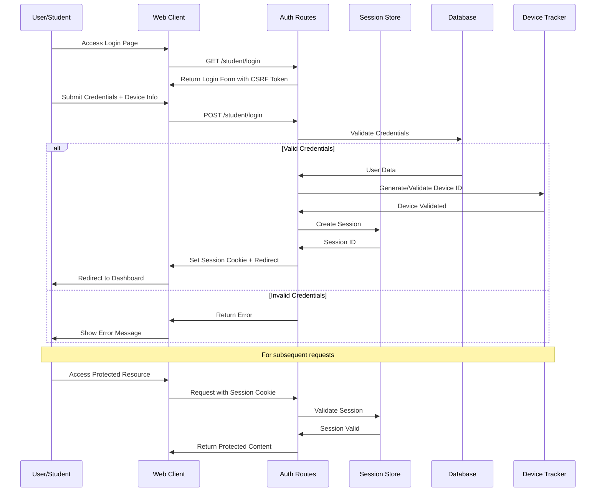
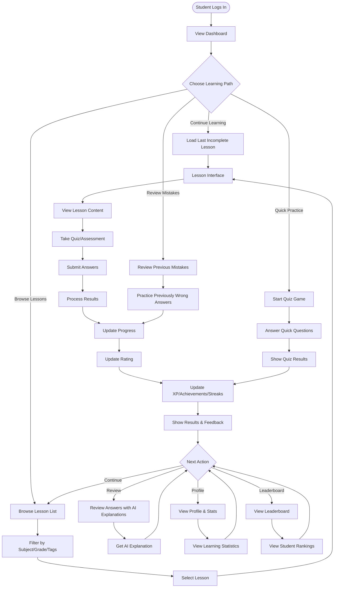
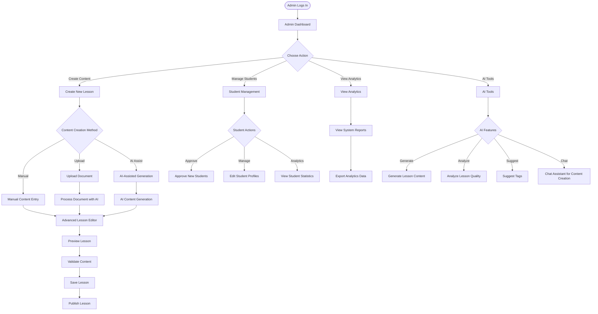
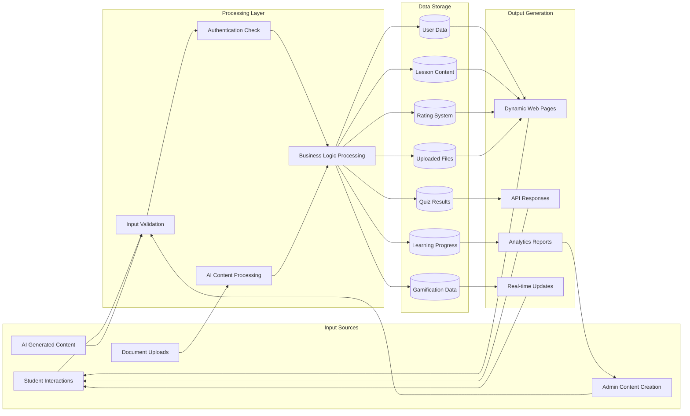
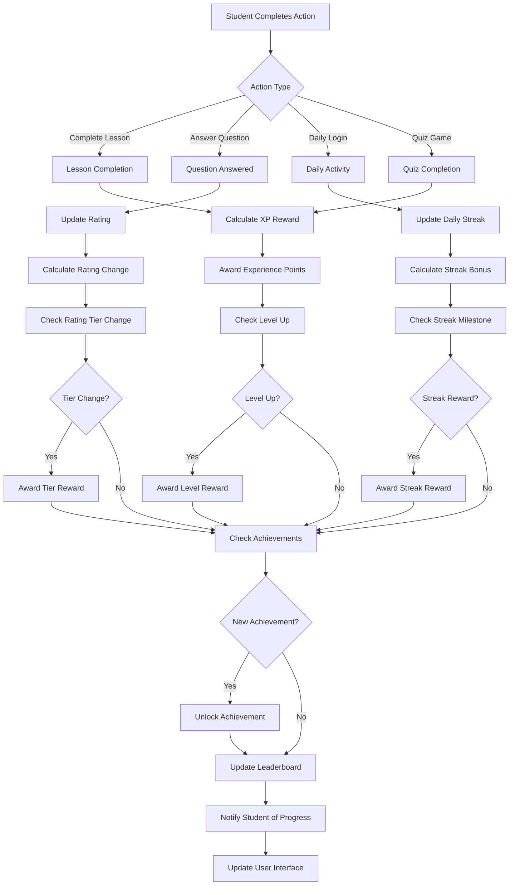
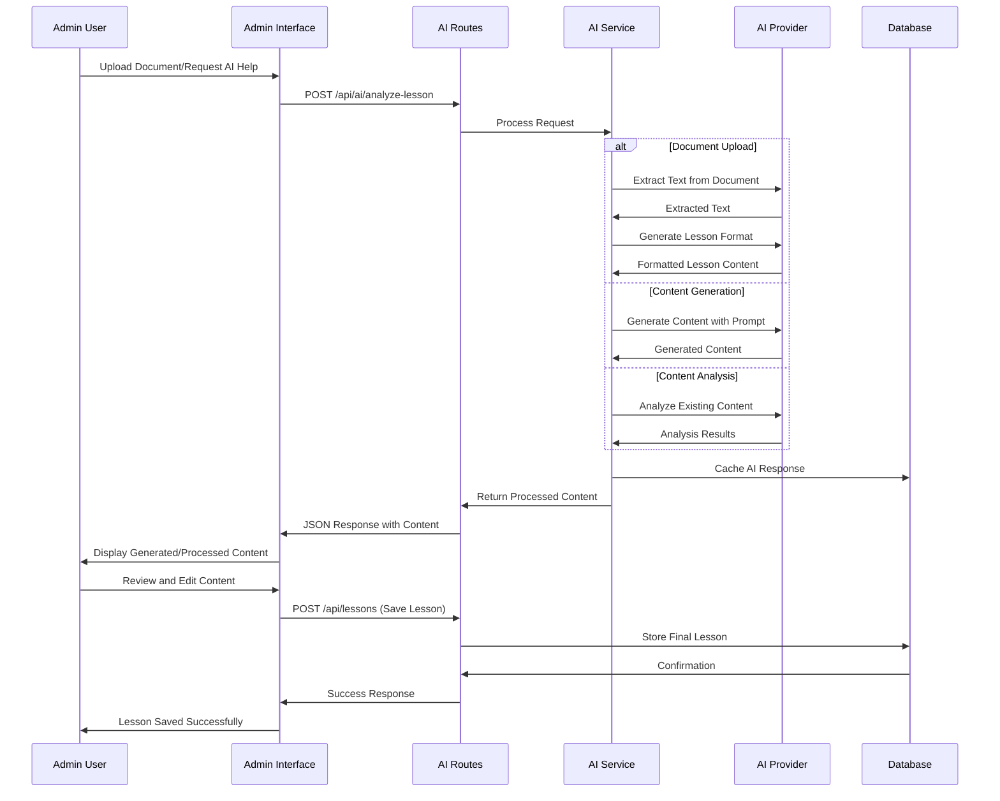
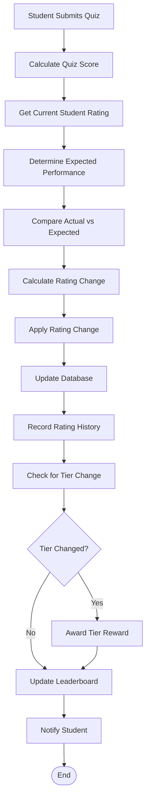

# Enhanced LLM Agent Project Guide: OnluyenVatLy

## Objective
This document provides an in-depth, file-by-file analysis of the OnluyenVatLy project, with a focus on the `routes` directory. It is designed to give an LLM agent a granular understanding of the application's API endpoints and their functionalities.

## Implementation Plan
1. **API Entry Point and Route Integration**
   - **Dependencies**: None
   - **Notes**: This section will explain how the Express application is initialized in `api/index.js` and how all the different route files from the `routes` directory are loaded and integrated.
   - **Files**: `api/index.js`
   - **Status**: Completed
2. **Route-by-Route Analysis**
   - **Dependencies**: Task 1
   - **Notes**: This section will provide a detailed breakdown of each file in the `routes` directory. For each file, it will list the defined routes, their purpose, the corresponding controller methods, and any middleware used.
   - **Files**: All files in `routes/`
   - **Status**: Completed

## Verification Criteria
- The LLM agent can accurately describe the function of any given route in the application.
- The LLM agent can identify the controller and middleware associated with each route.
- The LLM agent can effectively use this guide to navigate the codebase and understand the API.

## Security & Encryption Implementation (2025-07-11)

### Comprehensive Encryption System
A complete end-to-end encryption system has been implemented to protect sensitive test data:

**Core Components:**
- **Encryption Service** (`lib/services/encryptionService.js`): AES-256-CBC with HMAC authentication
- **Encryption Middleware** (`lib/middleware/encryption.js`): Automatic request/response encryption
- **Client-Side Encryption** (`public/js/encryption.js`): Web Crypto API implementation
- **Session Integration**: Unique encryption keys per user session with automatic rotation

**Protected Endpoints:**
- `GET /api/quiz/` - Quiz questions (encrypted)
- `POST /api/quiz/submit` - Quiz submissions (encrypted)
- `GET /api/lessons/:id` - Lesson content with questions (encrypted)
- `POST /api/results` - Result submissions (encrypted)
- `POST /api/explain` - AI explanations (encrypted)
- `POST /api/encryption/init` - Encryption key exchange

**Security Features:**
- Session-based encryption keys (unique per user)
- CSRF protection maintained alongside encryption
- Integrity verification with HMAC-SHA256
- Anti-replay protection with timestamps
- Automatic key rotation on authentication

### Production-Safe Logging System
A centralized logging system prevents data leakage in production:

**Logger Service** (`lib/utils/logger.js`):
- Environment-based logging controls (`LOG_LEVEL` in .env)
- Automatic data sanitization in production
- Sensitive pattern detection and redaction
- Client-side logging disabled on production domains

**Configuration:**
- Development: `LOG_LEVEL=TRACE` (full logging)
- Production: `LOG_LEVEL=WARN` (minimal logging, no sensitive data)

**Critical Security Notes:**
- All quiz questions and answers are encrypted in transit
- Console logs containing sensitive data are disabled in production
- Encryption keys are session-specific and cannot be reused across sessions
- CSRF tokens are extracted from encrypted requests and moved to headers

## Potential Risks and Mitigations
1. **Complexity**: The sheer number of routes and their intricate connections could still be overwhelming.
   - **Mitigation**: The guide will be structured logically, with clear headings and explanations for each route. A summary table will be included for quick reference.
2. **Dynamic Behavior**: The guide will describe the static structure of the routes, but the application's behavior might change based on the database state or user input.
   - **Mitigation**: The guide will highlight the key services and controllers that interact with the routes, encouraging the agent to examine these files for a deeper understanding of the dynamic behavior.
3. **Out-of-Date Information**: As the codebase evolves, the guide might become outdated.
   - **Mitigation**: The guide will be generated based on the current state of the codebase. It is recommended to regenerate the guide whenever significant changes are made to the routing structure.
4. **Encryption Key Management**: Improper handling of encryption keys could compromise security.
   - **Mitigation**: Keys are stored in server-side sessions only, never exposed to client-side storage, and automatically rotated on authentication events.

## Alternative Approaches
1. **Automated Documentation Generation**: A tool like Swagger or OpenAPI could be used to automatically generate API documentation from the code. This would provide a more interactive and always-up-to-date reference.
2. **Interactive Code Walkthroughs**: An interactive tutorial could be created to guide the LLM agent through the process of tracing a request from a route to the corresponding controller and service, and finally to the database.

## API Entry Point and Route Integration (`api/index.js`)

The main entry point of the OnluyenVatLy application is `api/index.js`. This file is responsible for setting up the Express server, configuring middleware, and integrating all the application's routes. Below is a detailed breakdown of its key functionalities:

### 1. Initialization and Dependencies

The file begins by loading environment variables from a `.env` file using `dotenv`. It then imports the necessary modules, including `express` for the web server, `path` for working with file paths, `cookie-parser` for handling cookies, and `compression` for response compression.

```javascript
// Load environment variables from .env file
require('dotenv').config();

const express = require('express');
const path = require('path');
const cookieParser = require('cookie-parser');
const compression = require('compression');
```

### 2. Configuration and Middleware

The application configures and uses several middleware to handle requests and enhance security and performance:

*   **Session Management**: It imports `sessionConfig` and `sessionStore` from `../lib/config/session` to configure user sessions. The `express-session` middleware is then used to manage sessions, with `trust proxy` set to 1 to ensure compatibility with services like Vercel and Heroku.

    ```javascript
    const { sessionConfig, sessionStore } = require('../lib/config/session');
    // ...
    app.set('trust proxy', 1); // Trust first proxy, crucial for Vercel/Heroku/etc.
    app.use(sessionConfig);
    ```

*   **Static File Serving**: The `express.static` middleware is used to serve static files from the `public` directory. It includes optimized cache headers for different file types to improve performance.

    ```javascript
    app.use(express.static(path.join(process.cwd(), 'public'), {
        maxAge: '1d',
        // ...
    }));
    ```

*   **Request Logging and Body Parsing**: It uses a custom middleware to log incoming requests and their response times. `express.json` and `express.urlencoded` are used to parse JSON and URL-encoded request bodies.

    ```javascript
    app.use((req, res, next) => {
        // ... logging logic ...
    });
    app.use(express.json({ limit: '10mb' }));
    app.use(express.urlencoded({ limit: '10mb', extended: true, parameterLimit: 50000 }));
    ```

*   **Security**: The application implements CSRF protection using `addCSRFToken` and `validateCSRFToken` middleware from `../lib/middleware/csrf`. It also includes rate limiting for API routes via `generalAPIRateLimit` from `../lib/middleware/rateLimiting`.

    ```javascript
    const { addCSRFToken, validateCSRFToken, getCSRFTokenEndpoint } = require('../lib/middleware/csrf');
    app.use(addCSRFToken);
    app.get('/api/csrf-token', getCSRFTokenEndpoint);
    app.use('/api', validateCSRFToken);
    ```

### 3. Route Integration

The core of the application's routing is handled in this section. It imports all the route modules from the `routes` directory and mounts them on the Express application. Most API routes are prefixed with `/api`, while the view routes are mounted at the root level.

```javascript
// Setup API routes
app.use('/api/auth', authRoutes);
app.use('/api/students', studentRoutes);
// ... and so on for all other API routes

// Setup view routes (HTML pages)
app.use('/', viewRoutes);
```

### 4. Error Handling and Server Initialization

The file sets up global error handlers for `uncaughtException` and `unhandledRejection` to ensure the application exits gracefully in case of a fatal error. A custom `errorHandler` middleware is also used to handle application-level errors. Finally, it starts the server and listens on the configured port, with graceful shutdown logic for `SIGTERM` and `SIGINT` signals.

```javascript
process.on('uncaughtException', (error) => {
  // ...
});

app.use(errorHandler);

const server = app.listen(PORT, () => {
    // ...
});

process.on('SIGTERM', () => {
    // ...
});
```


### Route Loading

The following is a list of all the route files that are loaded in `api/index.js` and their corresponding base paths:

| File                  | Base Path                |
| --------------------- | ------------------------ |
| `routes/auth.js`      | `/api/auth`              |
| `routes/students.js`  | `/api/students`          |
| `routes/lessons.js`   | `/api/lessons`           |
| `routes/ratings.js`   | `/api/ratings`           |
| `routes/uploads.js`   | `/api/uploads`           |
| `routes/results.js`   | `/api/results`           |
| `routes/gallery.js`   | `/api/gallery`           |
| `routes/quiz.js`      | `/api/quiz`              |
| `routes/tags.js`      | `/api/tags`              |
| `routes/explain.js`   | `/api/explain`           |
| `routes/ai.js`        | `/api/ai`                |
| `routes/admin.js`     | `/api/admin`             |
| `routes/history.js`   | `/api/history`           |
| `routes/progress.js`  | `/api/progress`          |
| `routes/settings.js`  | `/api/settings`          |
| `routes/streaks.js`   | `/api/streaks`           |
| `routes/xp.js`        | `/api/xp`                |
| `routes/achievements.js`| `/api/achievements`      |
| `routes/quests.js`    | `/api/quests`            |
| `routes/activity.js`  | `/api/activity`          |
| `routes/leagues.js`   | `/api/leagues`           |
| `routes/webhooks.js`  | `/api/webhooks`          |
| `routes/debug.js`     | `/api/debug`             |
| `routes/encryption.js`| `/api/encryption`        |
| `routes/views.js`     | `/`                      |

## Route-by-Route Analysis

This section provides a detailed breakdown of each file in the `routes` directory.

### `routes/auth.js`

This file defines the routes for user authentication and authorization. It handles login, logout, registration, and session management for both students and administrators. Below is a detailed breakdown of the routes:

#### Admin Authentication

*   **`POST /admin/login`**: This route is used for administrator login.
    *   **Controller Method**: `authController.adminLogin`
    *   **Middleware**: `authRateLimit`, `logAuthEvent('admin_login_attempt')`, `requireNotAuthenticated`, `validateAdminLogin`

*   **`POST /admin/logout`**: This route logs out an administrator.
    *   **Controller Method**: `authController.logout`
    *   **Middleware**: `requireAdminAuth`, `logAuthEvent('admin_logout')`

*   **`GET /admin/check`**: This route checks if an administrator is currently authenticated.
    *   **Controller Method**: `authController.checkAdminAuth`
    *   **Middleware**: None

#### Student Authentication

*   **`POST /student/login`**: This route is for student login.
    *   **Controller Method**: `authController.studentLogin`
    *   **Middleware**: `authRateLimit`, `logAuthEvent('student_login_attempt')`, `requireNotAuthenticated`, `validateStudentLogin`

*   **`POST /student/register`**: This route handles new student registration.
    *   **Controller Method**: `authController.studentRegister`
    *   **Middleware**: `authRateLimit`, `logAuthEvent('student_register_attempt')`, `requireNotAuthenticated`, `validateStudentRegistration`

*   **`POST /student/logout`**: This route logs out a student.
    *   **Controller Method**: `authController.logout`
    *   **Middleware**: `requireStudentAuth`, `logAuthEvent('student_logout')`

*   **`GET /student/check`**: This route checks if a student is authenticated. An alias, `GET /check-student-auth`, is also provided for backward compatibility.
    *   **Controller Method**: `authController.checkStudentAuth`
    *   **Middleware**: None

#### General Authentication and Session Management

*   **`POST /logout`**: A general logout route.
    *   **Controller Method**: `authController.logout`
    *   **Middleware**: `logAuthEvent('logout')`

*   **`GET /check`**: Checks the authentication status of the current user (either student or admin).
    *   **Controller Method**: `authController.checkAuth`
    *   **Middleware**: None

*   **`GET /session`**: Retrieves information about the current session.
    *   **Controller Method**: `authController.getSessionInfo`
    *   **Middleware**: None

*   **`POST /refresh`**: Refreshes the current session.
    *   **Controller Method**: `authController.refreshSession`
    *   **Middleware**: None

#### Password and Device Management

*   **`POST /change-password`**: Allows a student to change their password.
    *   **Controller Method**: `authController.changePassword`
    *   **Middleware**: `authRateLimit`, `requireStudentAuth`, `logAuthEvent('password_change_attempt')`

*   **`POST /logout-all`**: Logs a student out of all their devices.
    *   **Controller Method**: `authController.logoutAllDevices`
    *   **Middleware**: `requireStudentAuth`, `logAuthEvent('logout_all_devices')`

*   **`POST /validate-device`**: Validates the current device for a student.
    *   **Controller Method**: `authController.validateDevice`
    *   **Middleware**: `requireStudentAuth`


### `routes/students.js`

This file handles routes related to student management, including administrative actions, profile management, and data handling. Here’s a breakdown of the key routes:

#### Administrator-Only Routes

These routes are restricted to administrators and are used for managing student accounts.

*   **`GET /`**: Retrieves a paginated list of all students.
    *   **Controller Method**: `studentController.getAllStudents`
    *   **Middleware**: `requireAdminAuth`, `validatePagination`, `shortCacheMiddleware(300)`

*   **`GET /pending`**: Fetches a list of students whose accounts are pending approval.
    *   **Controller Method**: `studentController.getPendingStudents`
    *   **Middleware**: `requireAdminAuth`, `noCacheMiddleware`

*   **`GET /approved`**: Returns a list of all approved students.
    *   **Controller Method**: `studentController.getApprovedStudents`
    *   **Middleware**: `requireAdminAuth`, `shortCacheMiddleware(300)`

*   **`POST /:studentId/approve`**: Approves a student's account.
    *   **Controller Method**: `studentController.approveStudent`
    *   **Middleware**: `requireAdminAuth`, `validateIdParam('studentId')`, `noCacheMiddleware`

*   **`POST /:studentId/reject`**: Rejects a student's account.
    *   **Controller Method**: `studentController.rejectStudent`
    *   **Middleware**: `requireAdminAuth`, `validateIdParam('studentId')`, `noCacheMiddleware`

*   **`DELETE /:studentId`**: Deletes a student's account.
    *   **Controller Method**: `studentController.deleteStudent`
    *   **Middleware**: `requireAdminAuth`, `validateIdParam('studentId')`, `noCacheMiddleware`

*   **`POST /:studentId/reset-password`**: Resets a student's password.
    *   **Controller Method**: `studentController.resetStudentPassword`
    *   **Middleware**: `requireAdminAuth`, `validateIdParam('studentId')`, `noCacheMiddleware`

#### Student Profile Routes

These routes are for managing and viewing student profiles. Access is generally restricted to authenticated users.

*   **`GET /profile`**: Retrieves the profile of the currently logged-in student.
    *   **Controller Method**: `studentController.getCurrentStudentProfile`
    *   **Middleware**: `requireStudentAuth`, `shortCacheMiddleware(600)`

*   **`GET /:studentId/profile`**: Fetches the profile of a specific student.
    *   **Controller Method**: `studentController.getStudentProfile`
    *   **Middleware**: `requireStudentAuth`, `validateIdParam('studentId')`, `shortCacheMiddleware(600)`

*   **`PUT /:studentId/profile`**: Updates a student's profile.
    *   **Controller Method**: `studentController.updateStudentProfile`
    *   **Middleware**: `requireAdminOrOwner`, `validateIdParam('studentId')`, `noCacheMiddleware`

*   **`GET /:studentId/statistics`**: Retrieves statistics for a specific student.
    *   **Controller Method**: `studentController.getStudentStatistics`
    *   **Middleware**: `requireStudentAuth`, `validateIdParam('studentId')`, `shortCacheMiddleware(300)`

*   **`GET /:studentId/activity`**: Fetches the activity feed for a specific student.
    *   **Controller Method**: `studentController.getStudentActivity`
    *   **Middleware**: `requireStudentAuth`, `validateIdParam('studentId')`, `validatePagination`, `shortCacheMiddleware(300)`

#### Device and Data Management

These routes are for managing student devices, avatars, and data.

*   **`PUT /:studentId/device`**: Updates the device information for a student.
    *   **Controller Method**: `studentController.updateDeviceInfo`
    *   **Middleware**: `requireAdminOrOwner`, `validateIdParam('studentId')`, `noCacheMiddleware`

*   **`POST /info`**: Sets student information in the session.
    *   **Controller Method**: `studentController.setStudentInfo`
    *   **Middleware**: `requireStudentAuth`, `noCacheMiddleware`

*   **`GET /info`**: Gets student information from the session.
    *   **Controller Method**: `studentController.getStudentInfo`
    *   **Middleware**: `requireStudentAuth`, `noCacheMiddleware`

*   **`POST /avatar`**: Allows a student to upload their profile avatar.
    *   **Controller Method**: `studentController.uploadAvatar`
    *   **Middleware**: `requireStudentAuth`, `noCacheMiddleware`

*   **`DELETE /avatar`**: Allows a student to remove their profile avatar.
    *   **Controller Method**: `studentController.removeAvatar`
    *   **Middleware**: `requireStudentAuth`, `noCacheMiddleware`

*   **`GET /devices`**: Manages a student's linked devices.
    *   **Controller Method**: `studentController.getDevices`
    *   **Middleware**: `requireStudentAuth`, `noCacheMiddleware`

*   **`DELETE /devices/:deviceId`**: Removes a specific device.
    *   **Controller Method**: `studentController.removeDevice`
    *   **Middleware**: `requireStudentAuth`, `validateIdParam('deviceId')`, `noCacheMiddleware`

*   **`GET /export-data`**: Allows a student to export their data.
    *   **Controller Method**: `studentController.exportData`
    *   **Middleware**: `requireStudentAuth`, `noCacheMiddleware`

*   **`POST /delete-request`**: Allows a student to request the deletion of their account.
    *   **Controller Method**: `studentController.requestAccountDeletion`
    *   **Middleware**: `requireStudentAuth`, `noCacheMiddleware`


### `routes/lessons.js`

This file defines the routes for managing and retrieving lessons. It includes routes for public access, student-specific functionality, and administrator-only actions.

#### Public Lesson Routes

These routes are accessible to everyone, with optional authentication to personalize the experience.

*   **`GET /`**: Fetches a paginated and searchable list of all lessons.
    *   **Controller Method**: `lessonController.getAllLessons`
    *   **Middleware**: `optionalAuth`, `validatePagination`, `validateSearch`, `lessonCacheMiddleware`

*   **`GET /search`**: Performs a search for lessons based on a query.
    *   **Controller Method**: `lessonController.searchLessons`
    *   **Middleware**: `optionalAuth`, `validatePagination`, `validateSearch`, `lessonCacheMiddleware`

*   **`GET /featured`**: Retrieves a list of featured lessons.
    *   **Controller Method**: `lessonController.getFeaturedLessons`
    *   **Middleware**: `optionalAuth`, `validatePagination`, `lessonCacheMiddleware`

*   **`GET /recent`**: Gets a list of the most recently added lessons.
    *   **Controller Method**: `lessonController.getRecentLessons`
    *   **Middleware**: `optionalAuth`, `validatePagination`, `lessonCacheMiddleware`

*   **`GET /subject/:subject`**: Filters lessons by subject.
    *   **Controller Method**: `lessonController.getLessonsBySubject`
    *   **Middleware**: `optionalAuth`, `validatePagination`, `lessonCacheMiddleware`

*   **`GET /grade/:grade`**: Filters lessons by grade.
    *   **Controller Method**: `lessonController.getLessonsByGrade`
    *   **Middleware**: `optionalAuth`, `validatePagination`, `lessonCacheMiddleware`

*   **`GET /tags/:tags`**: Filters lessons by tags.
    *   **Controller Method**: `lessonController.getLessonsByTags`
    *   **Middleware**: `optionalAuth`, `validatePagination`, `lessonCacheMiddleware`

*   **`GET /:id`**: Retrieves a single lesson by its ID. **[ENCRYPTED - contains quiz questions]**
    *   **Controller Method**: `lessonController.getLessonById`
    *   **Middleware**: `optionalAuth`, `validateIdParam('id')`, `lessonCacheMiddleware`, `lessonEncryptionMiddleware`

*   **`GET /:id/rankings`**: Fetches the student rankings for a specific lesson.
    *   **Controller Method**: `lessonController.getStudentRankings`
    *   **Middleware**: `optionalAuth`, `validateIdParam('id')`, `shortCacheMiddleware(300)`

#### Student-Specific Routes

These routes require student authentication and provide personalized content.

*   **`GET /last-incomplete`**: Retrieves the last lesson that the authenticated student has not completed.
    *   **Controller Method**: `lessonController.getLastIncompleteLesson`
    *   **Middleware**: `requireStudentAuth`, `noCacheMiddleware`

#### Administrator-Only Routes

These routes are restricted to administrators and are used for managing lesson content and AI-powered features.

*   **`POST /`**: Creates a new lesson.
    *   **Controller Method**: `lessonController.createLesson`
    *   **Middleware**: `requireAdminAuth`, `validateLesson`, `noCacheMiddleware`

*   **`PUT /:id`**: Updates an existing lesson.
    *   **Controller Method**: `lessonController.updateLesson`
    *   **Middleware**: `requireAdminAuth`, `validateIdParam('id')`, `validateLesson`, `noCacheMiddleware`

*   **`DELETE /:id`**: Deletes a lesson.
    *   **Controller Method**: `lessonController.deleteLesson`
    *   **Middleware**: `requireAdminAuth`, `validateIdParam('id')`, `noCacheMiddleware`

*   **`POST /reorder`**: Updates the order of lessons.
    *   **Controller Method**: `lessonController.updateLessonOrder`
    *   **Middleware**: `requireAdminAuth`, `noCacheMiddleware`

*   **`POST /:id/duplicate`**: Creates a duplicate of an existing lesson.
    *   **Controller Method**: `lessonController.duplicateLesson`
    *   **Middleware**: `requireAdminAuth`, `validateIdParam('id')`, `noCacheMiddleware`

*   **`GET /:id/statistics`**: Retrieves statistics for a specific lesson.
    *   **Controller Method**: `lessonController.getLessonStatistics`
    *   **Middleware**: `requireAdminAuth`, `validateIdParam('id')`, `statisticsCacheMiddleware`

*   **`GET /:id/results`**: Gets the results of a lesson for all students.
    *   **Controller Method**: `lessonController.getLessonResults`
    *   **Middleware**: `requireAdminAuth`, `validateIdParam('id')`, `validatePagination`, `shortCacheMiddleware(300)`

*   **`POST /generate-summary`**: Triggers AI-powered lesson summary generation.
    *   **Controller Method**: `lessonController.generateLessonSummary`
    *   **Middleware**: `requireAdminAuth`, `noCacheMiddleware`

*   **`POST /generate-image`**: Triggers AI-powered lesson image generation.
    *   **Controller Method**: `lessonController.generateLessonImage`
    *   **Middleware**: `requireAdminAuth`, `noCacheMiddleware`

*   **`POST /:id/generate-image`**: Triggers AI-powered lesson image generation for a specific lesson.
    *   **Controller Method**: `lessonController.generateLessonImage`
    *   **Middleware**: `requireAdminAuth`, `validateIdParam('id')`, `noCacheMiddleware`

*   **`POST /generate-image-variations`**: Triggers AI-powered lesson image variations generation.
    *   **Controller Method**: `lessonController.generateImageVariations`
    *   **Middleware**: `requireAdminAuth`, `noCacheMiddleware`

*   **`POST /bulk-generate-summaries`**: Triggers bulk AI-powered lesson summary generation.
    *   **Controller Method**: `lessonController.bulkGenerateAiSummaries`
    *   **Middleware**: `requireAdminAuth`, `noCacheMiddleware`


### `routes/ratings.js`

This file handles routes related to student ratings and leaderboards. It provides endpoints for fetching rating data, managing student ratings, and running utility functions.

#### Public Rating Routes

These routes are publicly accessible and provide general rating and leaderboard information. They use `optionalAuth` to allow access to all users.

*   **`GET /`**: Retrieves a paginated list of ratings.
    *   **Controller Method**: `ratingController.getRatings`
    *   **Middleware**: `optionalAuth`, `validatePagination`, `shortCacheMiddleware(300)`

*   **`GET /leaderboard`**: Fetches the main leaderboard, with pagination support.
    *   **Controller Method**: `ratingController.getLeaderboard`
    *   **Middleware**: `optionalAuth`, `validatePagination`, `shortCacheMiddleware(300)`

*   **`GET /statistics`**: Gets overall rating statistics for the platform.
    *   **Controller Method**: `ratingController.getRatingStatistics`
    *   **Middleware**: `optionalAuth`, `shortCacheMiddleware(600)`

*   **`GET /tiers`**: Retrieves all rating tiers.
    *   **Controller Method**: `ratingController.getAllRatingTiers`
    *   **Middleware**: `optionalAuth`, `shortCacheMiddleware(3600)`

*   **`GET /tier`**: Fetches a specific rating tier.
    *   **Controller Method**: `ratingController.getRatingTier`
    *   **Middleware**: `optionalAuth`, `shortCacheMiddleware(3600)`

*   **`GET /distribution`**: Gets the distribution of students across different rating tiers.
    *   **Controller Method**: `ratingController.getRatingDistribution`
    *   **Middleware**: `optionalAuth`, `shortCacheMiddleware(600)`

*   **`GET /top-performers`**: Retrieves a list of top-performing students, with pagination.
    *   **Controller Method**: `ratingController.getTopPerformers`
    *   **Middleware**: `optionalAuth`, `validatePagination`, `shortCacheMiddleware(300)`

#### Student-Specific Rating Routes

These routes are for accessing the rating information of a specific student. Access is restricted to the student themselves or an administrator.

*   **`GET /student/:studentId`**: Retrieves the rating for a specific student.
    *   **Controller Method**: `ratingController.getStudentRating`
    *   **Middleware**: `requireAdminOrOwner`, `validateIdParam('studentId')`, `shortCacheMiddleware(300)`

*   **`GET /student/:studentId/history`**: Fetches the rating history for a student, with pagination.
    *   **Controller Method**: `ratingController.getStudentRatingHistory`
    *   **Middleware**: `requireAdminOrOwner`, `validateIdParam('studentId')`, `validatePagination`, `shortCacheMiddleware(300)`

#### Rating Management Routes

These routes are for managing student ratings and are restricted to administrators.

*   **`POST /update`**: Updates a student's rating.
    *   **Controller Method**: `ratingController.updateStudentRating`
    *   **Middleware**: `requireAdminAuth`, `noCacheMiddleware`

*   **`POST /student/:studentId/reset`**: Resets the rating for a specific student.
    *   **Controller Method**: `ratingController.resetStudentRating`
    *   **Middleware**: `requireAdminAuth`, `validateIdParam('studentId')`, `noCacheMiddleware`

#### Utility Routes

These routes provide utility functions related to ratings and are accessible to all users.

*   **`POST /calculate-metrics`**: Calculates performance metrics based on the provided data.
    *   **Controller Method**: `ratingController.calculatePerformanceMetrics`
    *   **Middleware**: `optionalAuth`, `noCacheMiddleware`

*   **`POST /simulate`**: Simulates a rating change.
    *   **Controller Method**: `ratingController.simulateRatingChange`
    *   **Middleware**: `optionalAuth`, `noCacheMiddleware`


### `routes/uploads.js`

This file defines the routes for handling file uploads, including images and documents. All routes in this file require administrator authentication.

#### Image Upload Routes

*   **`POST /image`**: Uploads a single image.
    *   **Controller Method**: `uploadController.uploadLessonImage`
    *   **Middleware**: `requireAdminAuth`, `noCacheMiddleware`, `uploadRateLimit`, `upload.single('image')`, `uploadErrorHandler`, `validateFileUpload`

*   **`POST /images/bulk`**: Uploads multiple images (up to 10) at once.
    *   **Controller Method**: `uploadController.bulkUploadImages`
    *   **Middleware**: `requireAdminAuth`, `noCacheMiddleware`, `uploadRateLimit`, `upload.array('images', 10)`, `uploadErrorHandler`, `validateFileUpload`

*   **`DELETE /image/:filename`**: Deletes an image from the server.
    *   **Controller Method**: `uploadController.deleteImage`
    *   **Middleware**: `requireAdminAuth`, `noCacheMiddleware`, `uploadRateLimit`, `validateIdParam('filename')`

#### Document Upload Routes

*   **`POST /document`**: Uploads a single document (PDF or DOCX).
    *   **Controller Method**: `uploadController.uploadDocument`
    *   **Middleware**: `requireAdminAuth`, `noCacheMiddleware`, `uploadRateLimit`, `upload.single('document')`, `uploadErrorHandler`, `validateFileUpload`

#### Utility Routes

*   **`POST /validate`**: Validates a file without actually uploading it.
    *   **Controller Method**: `uploadController.validateFile`
    *   **Middleware**: `requireAdminAuth`, `noCacheMiddleware`, `uploadRateLimit`, `upload.single('file')`, `uploadErrorHandler`

*   **`GET /config`**: Retrieves the upload configuration, such as file size limits and allowed types.
    *   **Controller Method**: `uploadController.getUploadConfig`
    *   **Middleware**: `requireAdminAuth`, `noCacheMiddleware`, `uploadRateLimit`, `shortCacheMiddleware(3600)`

*   **`GET /storage/stats`**: Gets statistics about the storage usage.
    *   **Controller Method**: `uploadController.getStorageStats`
    *   **Middleware**: `requireAdminAuth`, `noCacheMiddleware`, `uploadRateLimit`, `shortCacheMiddleware(300)`

*   **`POST /test-ai`**: A route for testing the AI service.
    *   **Controller Method**: `uploadController.testAIService`
    *   **Middleware**: `requireAdminAuth`, `noCacheMiddleware`, `uploadRateLimit`


### `routes/results.js`

This file handles routes related to lesson results. It includes routes for submitting results, retrieving result data, and managing results.

#### Result Submission

*   **`POST /`**: Submits a lesson result for the authenticated student. **[ENCRYPTED]**
    *   **Controller Method**: `resultController.submitResult`
    *   **Middleware**: `requireStudentAuth`, `validateResult`, `noCacheMiddleware`, `resultEncryptionMiddleware`

#### Result Retrieval

*   **`GET /:id`**: Retrieves a specific result by its ID.
    *   **Controller Method**: `resultController.getResultById`
    *   **Middleware**: `resultController.requireResultAccess`, `validateIdParam('id')`, `resultsCacheMiddleware`

*   **`GET /`**: Fetches all results.
    *   **Controller Method**: `resultController.getAllResults`
    *   **Middleware**: `requireAdminAuth`, `validatePagination`, `shortCacheMiddleware(300)`

*   **`GET /lesson/:lessonId`**: Retrieves all results for a specific lesson.
    *   **Controller Method**: `resultController.getResultsByLesson`
    *   **Middleware**: `requireAdminAuth`, `validateIdParam('lessonId')`, `validatePagination`, `shortCacheMiddleware(300)`

*   **`GET /student/:studentId`**: Gets all results for a specific student.
    *   **Controller Method**: `resultController.getResultsByStudent`
    *   **Middleware**: `requireAdminOrOwner`, `validateIdParam('studentId')`, `validatePagination`, `shortCacheMiddleware(300)`

*   **`GET /statistics/overview`**: Retrieves an overview of result statistics.
    *   **Controller Method**: `resultController.getResultStatistics`
    *   **Middleware**: `requireAdminAuth`, `shortCacheMiddleware(600)`

#### Result Management

*   **`DELETE /:id`**: Deletes a specific result.
    *   **Controller Method**: `resultController.deleteResult`
    *   **Middleware**: `requireAdminAuth`, `validateIdParam('id')`, `noCacheMiddleware`


### `routes/gallery.js`

This file defines the route for the image gallery.

*   **`GET /`**: Retrieves the images for the gallery.
    *   **Controller Method**: `galleryController.getGalleryImages`
    *   **Middleware**: `optionalAuth`, `shortCacheMiddleware(600)`


### `routes/quiz.js`

This file handles routes related to quizzes. **[ENCRYPTED ENDPOINTS]**

*   **`GET /`**: Retrieves the quiz for the authenticated student. **[ENCRYPTED]**
    *   **Controller Method**: `quizController.getQuiz`
    *   **Middleware**: `requireStudentAuth`, `shortCacheMiddleware(1800)`, `quizEncryptionMiddleware`

*   **`POST /submit`**: Submits the results of a quiz for the authenticated student. **[ENCRYPTED]**
    *   **Controller Method**: `quizController.submitQuiz`
    *   **Middleware**: `requireStudentAuth`, `noCacheMiddleware`, `quizEncryptionMiddleware`

*   **`POST /save`**: Saves the quiz configuration.
    *   **Controller Method**: `quizController.saveQuiz`
    *   **Middleware**: `requireAdminAuth`, `noCacheMiddleware`


### `routes/tags.js`

This file defines the routes for retrieving tag-related information.

*   **`GET /`**: Retrieves all tags.
    *   **Controller Method**: `tagsController.getAllTags`
    *   **Middleware**: `optionalAuth`, `longCacheMiddleware(3600)`

*   **`GET /popular`**: Retrieves popular tags.
    *   **Controller Method**: `tagsController.getPopularTags`
    *   **Middleware**: `optionalAuth`, `shortCacheMiddleware(600)`

*   **`GET /related/:tag`**: Retrieves tags related to a specific tag.
    *   **Controller Method**: `tagsController.getRelatedTags`
    *   **Middleware**: `optionalAuth`, `shortCacheMiddleware(300)`

*   **`GET /intersection`**: Retrieves tags that are common to a set of tags.
    *   **Controller Method**: `tagsController.getIntersectionTags`
    *   **Middleware**: `optionalAuth`, `shortCacheMiddleware(300)`

*   **`GET /complete`**: Retrieves a complete list of tags.
    *   **Controller Method**: `tagsController.getCompleteTags`
    *   **Middleware**: `optionalAuth`, `longCacheMiddleware(1800)`


### `routes/explain.js`

This file defines the route for the AI-powered answer explanation feature.

*   **`POST /`**: This route takes a question and answer as input and returns an AI-generated explanation. **[ENCRYPTED]**
    *   **Controller Method**: `explainController.explainAnswer`
    *   **Middleware**: `requireStudentAuth`, `noCacheMiddleware`, `aiRateLimit`, `resultEncryptionMiddleware`


### `routes/encryption.js`

This file defines the routes for encryption key management and secure communication setup.

*   **`POST /init`**: Initializes encryption for the current session and provides the encryption key to the client.
    *   **Controller Method**: Direct route handler
    *   **Middleware**: `requireAuth`, `addCSRFToken`, `noCacheMiddleware`

*   **`POST /rotate`**: Rotates the encryption key for the current session.
    *   **Controller Method**: Direct route handler
    *   **Middleware**: `requireAuth`, `addCSRFToken`, `noCacheMiddleware`

*   **`GET /status`**: Checks the encryption status for the current session.
    *   **Controller Method**: Direct route handler
    *   **Middleware**: `requireAuth`, `noCacheMiddleware`

*   **`DELETE /clear`**: Clears the encryption context for the current session.
    *   **Controller Method**: Direct route handler
    *   **Middleware**: `requireAuth`, `noCacheMiddleware`


### `routes/ai.js`

This file defines the routes for interacting with the AI services.

*   **`GET /cache/stats`**: Retrieves statistics about the AI cache.
    *   **Middleware**: `requireAdminAuth`, `noCacheMiddleware`

*   **`POST /cache/clear`**: Clears the AI cache.
    *   **Middleware**: `requireAdminAuth`, `noCacheMiddleware`

*   **`GET /usage/stats`**: Retrieves statistics about AI usage.
    *   **Middleware**: `requireAdminAuth`, `noCacheMiddleware`

*   **`POST /suggest-tags`**: Generates AI tag suggestions for a lesson.
    *   **Middleware**: `requireAdminAuth`, `noCacheMiddleware`

*   **`POST /chat-assist`**: Provides AI chat assistance for lesson creation.
    *   **Middleware**: `requireAdminAuth`, `noCacheMiddleware`

*   **`POST /analyze-lesson`**: Analyzes the content of a lesson.
    *   **Middleware**: `requireAdminAuth`, `noCacheMiddleware`

*   **`GET /cache/stats`**: Retrieves statistics about the AI cache, including memory usage and the number of cached items.
*   **`POST /cache/clear`**: Clears the AI cache. It can clear the entire cache or a specific type of cache.
*   **`GET /usage/stats`**: Gets statistics about AI usage, including the number of daily requests and estimated costs.
*   **`POST /suggest-tags`**: Suggests tags for a lesson based on its content.
*   **`POST /chat-assist`**: Provides AI-powered assistance for creating lessons. It supports both streaming and non-streaming responses.
*   **`POST /analyze-lesson`**: Analyzes the content of a lesson and provides feedback.


### `routes/admin.js`

This file defines the routes for administrative tasks.

*   **`GET /students`**: Retrieves a list of all students.
    *   **Controller Method**: `adminController.getStudents`
    *   **Middleware**: `requireAdminAuth`, `noCacheMiddleware`

*   **`GET /unapproved-students`**: Retrieves a list of unapproved students.
    *   **Controller Method**: `adminController.getUnapprovedStudents`
    *   **Middleware**: `requireAdminAuth`, `noCacheMiddleware`

*   **`GET /approved-students`**: Retrieves a list of approved students.
    *   **Controller Method**: `adminController.getApprovedStudents`
    *   **Middleware**: `requireAdminAuth`, `noCacheMiddleware`

*   **`POST /students/:studentId/approve`**: Approves a student's account.
    *   **Controller Method**: `adminController.approveStudent`
    *   **Middleware**: `requireAdminAuth`, `noCacheMiddleware`

*   **`POST /students/:studentId/reject`**: Rejects a student's account.
    *   **Controller Method**: `adminController.rejectStudent`
    *   **Middleware**: `requireAdminAuth`, `noCacheMiddleware`

*   **`DELETE /students/:studentId`**: Deletes a student's account.
    *   **Controller Method**: `adminController.deleteStudent`
    *   **Middleware**: `requireAdminAuth`, `noCacheMiddleware`

*   **`POST /students/:studentId/device`**: Updates a student's device information.
    *   **Controller Method**: `adminController.updateDeviceInfo`
    *   **Middleware**: `requireAdminAuth`, `noCacheMiddleware`

*   **`DELETE /students/:studentId/device`**: Unbinds a student's device.
    *   **Controller Method**: `adminController.unbindDevice`
    *   **Middleware**: `requireAdminAuth`, `noCacheMiddleware`

*   **`GET /students/:studentId/profile`**: Retrieves a student's profile.
    *   **Controller Method**: `adminController.getStudentProfile`
    *   **Middleware**: `requireAdminAuth`, `noCacheMiddleware`

*   **`GET /dashboard-stats`**: Retrieves dashboard statistics.
    *   **Controller Method**: `adminController.getDashboardStats`
    *   **Middleware**: `requireAdminAuth`, `noCacheMiddleware`

*   **`POST /upload-image`**: Uploads an image.
    *   **Controller Method**: `uploadController.uploadLessonImage`
    *   **Middleware**: `requireAdminAuth`, `noCacheMiddleware`, `imageUpload.single('imageFile')`, `uploadErrorHandler`, `validateFileUpload`

*   **`POST /upload-document`**: Uploads a document.
    *   **Controller Method**: `uploadController.uploadDocument`
    *   **Middleware**: `requireAdminAuth`, `noCacheMiddleware`, `documentUpload.single('document')`, `uploadErrorHandler`, `validateFileUpload`

*   **`POST /process-document`**: Processes a document.
    *   **Controller Method**: `uploadController.uploadDocument`
    *   **Middleware**: `requireAdminAuth`, `noCacheMiddleware`, `documentUpload.single('document')`, `uploadErrorHandler`, `validateFileUpload`


### `routes/history.js`

This file defines the routes for accessing and managing historical data.

*   **`GET /`**: Retrieves a paginated and searchable list of historical data.
    *   **Controller Method**: `historyController.getHistory`
    *   **Middleware**: `requireAdminAuth`, `noCacheMiddleware`

*   **`DELETE /results/:resultId`**: Deletes a specific result.
    *   **Controller Method**: `historyController.deleteResult`
    *   **Middleware**: `requireAdminAuth`, `noCacheMiddleware`

*   **`GET /lessons/:lessonId/results`**: Retrieves the results for a specific lesson.
    *   **Controller Method**: `historyController.getLessonResults`
    *   **Middleware**: `requireAdminAuth`, `noCacheMiddleware`


### `routes/progress.js`

This file defines the routes for tracking and managing student progress.

*   **`GET /overview`**: Retrieves an overview of the student's progress.
    *   **Controller Method**: `progressController.getStudentProgress`
    *   **Middleware**: `requireStudentAuth`, `shortCacheMiddleware(300)`

*   **`GET /detailed`**: Retrieves detailed progress by topic or chapter.
    *   **Controller Method**: `progressController.getDetailedProgress`
    *   **Middleware**: `requireStudentAuth`, `shortCacheMiddleware(300)`

*   **`GET /stats`**: Retrieves learning statistics for the student.
    *   **Controller Method**: `progressController.getLearningStats`
    *   **Middleware**: `requireStudentAuth`, `shortCacheMiddleware(600)`

*   **`GET /recommendations`**: Retrieves recommended lessons for the student.
    *   **Controller Method**: `progressController.getRecommendedLessons`
    *   **Middleware**: `requireStudentAuth`, `shortCacheMiddleware(900)`

*   **`GET /mistakes`**: Retrieves a list of the student's mistakes to review.
    *   **Controller Method**: `progressController.getMistakesToReview`
    *   **Middleware**: `requireStudentAuth`, `shortCacheMiddleware(300)`

*   **`POST /mistakes/review`**: Marks mistakes as reviewed.
    *   **Controller Method**: `progressController.markMistakesReviewed`
    *   **Middleware**: `requireStudentAuth`, `noCacheMiddleware`

*   **`POST /practice/questions`**: Retrieves practice questions.
    *   **Controller Method**: `progressController.getPracticeQuestions`
    *   **Middleware**: `requireStudentAuth`, `noCacheMiddleware`

*   **`POST /practice/submit`**: Submits the results of a practice session.
    *   **Controller Method**: `progressController.submitPracticeResults`
    *   **Middleware**: `requireStudentAuth`, `noCacheMiddleware`

*   **`GET /achievements`**: Retrieves the student's achievements.
    *   **Controller Method**: `progressController.getAchievements`
    *   **Middleware**: `requireStudentAuth`, `shortCacheMiddleware(600)`

*   **`POST /streak`**: Updates the student's streak.
    *   **Controller Method**: `progressController.updateStreak`
    *   **Middleware**: `requireStudentAuth`, `noCacheMiddleware`

*   **`POST /lesson/:lessonId/complete`**: Marks a lesson as completed.
    *   **Controller Method**: `progressController.markLessonCompleted`
    *   **Middleware**: `requireStudentAuth`, `noCacheMiddleware`


### `routes/settings.js`

This file defines the routes for managing student settings.

*   **`GET /student`**: Retrieves the settings for the authenticated student.
    *   **Controller Method**: `settingsController.getStudentSettings`
    *   **Middleware**: `requireStudentAuth`, `shortCacheMiddleware(300)`

*   **`PUT /student`**: Updates the settings for the authenticated student.
    *   **Controller Method**: `settingsController.updateStudentSettings`
    *   **Middleware**: `requireStudentAuth`, `noCacheMiddleware`

*   **`PUT /student/privacy`**: Updates the privacy settings for the authenticated student.
    *   **Controller Method**: `settingsController.updatePrivacySettings`
    *   **Middleware**: `requireStudentAuth`, `noCacheMiddleware`

*   **`POST /student/avatar`**: Uploads an avatar for the authenticated student.
    *   **Controller Method**: `settingsController.uploadAvatar`
    *   **Middleware**: `requireStudentAuth`, `noCacheMiddleware`

*   **`DELETE /student/avatar`**: Removes the avatar for the authenticated student.
    *   **Controller Method**: `settingsController.removeAvatar`
    *   **Middleware**: `requireStudentAuth`, `noCacheMiddleware`

*   **`GET /student/devices`**: Retrieves a list of the authenticated student's devices.
    *   **Controller Method**: `settingsController.getStudentDevices`
    *   **Middleware**: `requireStudentAuth`, `noCacheMiddleware`

*   **`DELETE /student/devices/:deviceId`**: Removes a specific device for the authenticated student.
    *   **Controller Method**: `settingsController.removeDevice`
    *   **Middleware**: `requireStudentAuth`, `validateIdParam('deviceId')`, `noCacheMiddleware`

*   **`GET /student/export-data`**: Exports the authenticated student's data.
    *   **Controller Method**: `settingsController.exportStudentData`
    *   **Middleware**: `requireStudentAuth`, `noCacheMiddleware`

*   **`GET /student/statistics`**: Retrieves usage statistics for the authenticated student.
    *   **Controller Method**: `settingsController.getUsageStatistics`
    *   **Middleware**: `requireStudentAuth`, `shortCacheMiddleware(600)`

*   **`POST /student/delete-request`**: Requests account deletion for the authenticated student.
    *   **Controller Method**: `settingsController.requestAccountDeletion`
    *   **Middleware**: `requireStudentAuth`, `noCacheMiddleware`

*   **`POST /student/logout-all`**: Logs the authenticated student out of all devices.
    *   **Controller Method**: `settingsController.logoutAllDevices`
    *   **Middleware**: `requireStudentAuth`, `noCacheMiddleware`
*   **`PUT /student/privacy`**: Updates the privacy settings for the authenticated student.
*   **`POST /student/avatar`**: Uploads a new avatar for the student.
*   **`DELETE /student/avatar`**: Removes the student's avatar.
*   **`GET /student/devices`**: Retrieves a list of the student's devices.
*   **`DELETE /student/devices/:deviceId`**: Removes a specific device from the student's account.
*   **`GET /student/export-data`**: Exports the student's data.
*   **`GET /student/statistics`**: Retrieves usage statistics for the student. This is cached for 10 minutes.
*   **`POST /student/delete-request`**: Allows a student to request the deletion of their account.
*   **`POST /student/logout-all`**: Logs the student out of all their devices.


### `routes/streaks.js`

This file defines the routes for managing and tracking student learning streaks. It includes routes for recording activity, using streak freezes, and viewing leaderboards.

*   **`GET /stats`**: Retrieves streak statistics for the authenticated student.
    *   **Controller Method**: `streakService.getStreakStats`
    *   **Middleware**: `requireStudentAuth`

*   **`POST /activity`**: Records daily activity for the authenticated student and updates their streak.
    *   **Controller Method**: `streakService.recordDailyActivity`
    *   **Middleware**: `requireStudentAuth`

*   **`POST /freeze`**: Allows the authenticated student to use a streak freeze to protect their current streak.
    *   **Controller Method**: `streakService.useStreakFreeze`
    *   **Middleware**: `requireStudentAuth`

*   **`GET /leaderboard`**: Retrieves the streak leaderboard. This is a public route.
    *   **Controller Method**: `streakService.getStreakLeaderboard`
    *   **Middleware**: None

*   **`GET /top-performers`**: Retrieves the top streak performers. This is a public route.
    *   **Controller Method**: `streakService.getTopStreakPerformers`
    *   **Middleware**: None

*   **`GET /activity-history`**: Retrieves the streak activity history for the authenticated student.
    *   **Controller Method**: `streakService.getStreakActivityHistory`
    *   **Middleware**: `requireStudentAuth`

*   **`POST /reset-freezes`**: Resets streak freezes for a student. This is an admin-only route.
    *   **Controller Method**: `streakService.resetStreakFreezes`
    *   **Middleware**: `requireAdminAuth` (Note: to be added)

*   **`GET /milestones`**: Retrieves streak milestones and rewards. This is a public route.
    *   **Controller Method**: None (static data)
    *   **Middleware**: None

*   **`GET /student/:studentId`**: Retrieves streak information for a specific student. This is an admin-only route.
    *   **Controller Method**: `streakService.getStreakStats`
    *   **Middleware**: `requireAdminAuth` (Note: to be added)
*   **`GET /milestones`**: Retrieves a list of streak milestones and their rewards.
*   **`GET /student/:studentId`**: Retrieves the streak statistics for a specific student. This is an admin-only route.


### `routes/xp.js`

This file defines the routes for managing student experience points (XP). It includes routes for retrieving XP statistics, leaderboards, and history, as well as admin-only routes for awarding XP.

*   **`GET /stats`**: Retrieves XP statistics for the authenticated student.
    *   **Controller Method**: `xpService.getStudentXPStats`
    *   **Middleware**: `requireStudentAuth`

*   **`GET /leaderboard`**: Retrieves the XP leaderboard. This is a public route.
    *   **Controller Method**: `xpService.getXPLeaderboard`
    *   **Middleware**: None

*   **`GET /history`**: Retrieves the XP transaction history for the authenticated student.
    *   **Controller Method**: `xpService.getXPTransactionHistory`
    *   **Middleware**: `requireStudentAuth`

*   **`GET /levels`**: Retrieves information about XP levels and their requirements. This is a public route.
    *   **Controller Method**: None (static data)
    *   **Middleware**: None

*   **`POST /award`**: Awards XP to a student. This is an admin-only route.
    *   **Controller Method**: `xpService.awardXP`
    *   **Middleware**: `requireAdminAuth`

*   **`GET /student/:studentId`**: Retrieves XP information for a specific student. This is an admin-only route.
    *   **Controller Method**: `xpService.getStudentXPStats`
    *   **Middleware**: `requireAdminAuth`

*   **`GET /student/:studentId/history`**: Retrieves the XP transaction history for a specific student. This is an admin-only route.
    *   **Controller Method**: `xpService.getXPTransactionHistory`
    *   **Middleware**: `requireAdminAuth`

*   **`GET /level-calculator`**: Calculates the level for a given XP amount. This is a public route.
    *   **Controller Method**: `xpService.calculateLevel`
    *   **Middleware**: None

*   **`GET /rewards`**: Retrieves information about XP rewards for different activities. This is a public route.
    *   **Controller Method**: None (static data)
    *   **Middleware**: None


### `routes/achievements.js`

This file defines the routes for managing and tracking student achievements. It includes routes for viewing all achievements, student-specific achievements, and leaderboards.

*   **`GET /`**: Retrieves all available achievements. This is a public route.
    *   **Controller Method**: `achievementService.getAllAchievements`
    *   **Middleware**: None

*   **`GET /student`**: Retrieves the earned achievements for the authenticated student.
    *   **Controller Method**: `achievementService.getStudentAchievements`
    *   **Middleware**: `requireStudentAuth`

*   **`GET /student/:studentId`**: Retrieves the earned achievements for a specific student. This is an admin-only route.
    *   **Controller Method**: `achievementService.getStudentAchievements`
    *   **Middleware**: `requireAdminAuth`

*   **`GET /progress`**: Retrieves the achievement progress for the authenticated student.
    *   **Controller Method**: None (calculated in the route handler)
    *   **Middleware**: `requireStudentAuth`

*   **`POST /check`**: Manually checks for new achievements for the authenticated student.
    *   **Controller Method**: `achievementService.checkAndAwardAchievements`
    *   **Middleware**: `requireStudentAuth`

*   **`GET /statistics`**: Retrieves achievement statistics. This is a public route.
    *   **Controller Method**: `achievementService.getAchievementStatistics`
    *   **Middleware**: None

*   **`GET /leaderboard`**: Retrieves the achievement leaderboard. This is a public route.
    *   **Controller Method**: None (calculated in the route handler)
    *   **Middleware**: None

*   **`POST /award`**: Manually awards an achievement to a student. This is an admin-only route.
    *   **Controller Method**: `achievementService.awardAchievement`
    *   **Middleware**: `requireAdminAuth`

*   **`GET /categories`**: Retrieves achievement categories. This is a public route.
    *   **Controller Method**: None (calculated in the route handler)
    *   **Middleware**: None


### `routes/quests.js`

This file defines the routes for managing and tracking student quests. It includes routes for retrieving daily quests, tracking progress, and viewing leaderboards.

*   **`GET /daily`**: Retrieves the daily quests for the current day. This is a public route.
    *   **Controller Method**: `questService.generateDailyQuests`
    *   **Middleware**: None

*   **`GET /daily/:date`**: Retrieves the daily quests for a specific date. This is a public route.
    *   **Controller Method**: `questService.getDailyQuests`
    *   **Middleware**: None

*   **`GET /progress`**: Retrieves the quest progress for the authenticated student.
    *   **Controller Method**: `questService.getStudentQuestProgress`
    *   **Middleware**: `requireStudentAuth`

*   **`POST /progress/:questId`**: Updates the progress for a specific quest for the authenticated student.
    *   **Controller Method**: `questService.updateQuestProgress`
    *   **Middleware**: `requireStudentAuth`

*   **`POST /check`**: Checks and updates quest progress based on student activity.
    *   **Controller Method**: `questService.checkAndUpdateQuests`
    *   **Middleware**: `requireStudentAuth`

*   **`GET /student/:studentId/progress`**: Retrieves the quest progress for a specific student. This is an admin-only route.
    *   **Controller Method**: `questService.getStudentQuestProgress`
    *   **Middleware**: `requireAdminAuth`

*   **`GET /statistics`**: Retrieves quest completion statistics. This is an admin-only route.
    *   **Controller Method**: `questService.getQuestStatistics`
    *   **Middleware**: `requireAdminAuth`

*   **`POST /generate`**: Generates daily quests for a specific date. This is an admin-only route.
    *   **Controller Method**: `questService.generateDailyQuests`
    *   **Middleware**: `requireAdminAuth`

*   **`GET /templates`**: Retrieves available quest templates. This is an admin-only route.
    *   **Controller Method**: `questService.getQuestTemplates`
    *   **Middleware**: `requireAdminAuth`

*   **`GET /leaderboard`**: Retrieves the quest completion leaderboard. This is a public route.
    *   **Controller Method**: None (calculated in the route handler)
    *   **Middleware**: None


### `routes/activity.js`

This file defines the routes for retrieving and managing user activity.

*   **`GET /feed`**: Retrieves the public activity feed. This is a public route.
    *   **Controller Method**: `activityService.getPublicActivityFeed`
    *   **Middleware**: `asyncHandler`

*   **`GET /trending`**: Retrieves trending activities. This is a public route.
    *   **Controller Method**: `activityService.getTrendingActivities`
    *   **Middleware**: `asyncHandler`

*   **`GET /leaderboard`**: Retrieves leaderboard activities (top performers). This is a public route.
    *   **Controller Method**: `activityService.getLeaderboardActivities`
    *   **Middleware**: `asyncHandler`

*   **`GET /my-feed`**: Retrieves the student's personal activity feed.
    *   **Controller Method**: `activityService.getStudentActivityFeed`
    *   **Middleware**: `requireStudentAuth`, `asyncHandler`

*   **`POST /create`**: Creates a custom activity. This is an admin-only route.
    *   **Controller Method**: `activityService.createActivity`
    *   **Middleware**: `requireAdminAuth`, `asyncHandler`

*   **`GET /stats`**: Retrieves activity statistics. This is an admin-only route.
    *   **Controller Method**: `activityService.getActivityStatistics`
    *   **Middleware**: `requireAdminAuth`, `asyncHandler`

*   **`POST /cleanup`**: Cleans up old activities. This is an admin-only route.
    *   **Controller Method**: `activityService.cleanupOldActivities`
    *   **Middleware**: `requireAdminAuth`, `asyncHandler`

*   **`GET /types`**: Retrieves available activity types. This is a public route.
    *   **Controller Method**: None (static data)
    *   **Middleware**: `asyncHandler`


### `routes/leagues.js`

This file defines the routes for managing student leagues. It includes routes for retrieving league information, joining leagues, and viewing standings.

*   **`GET /current-season`**: Retrieves the current active league season. This is a public route.
    *   **Controller Method**: `leagueService.getCurrentSeason`
    *   **Middleware**: `asyncHandler`

*   **`GET /divisions`**: Retrieves all league divisions. This is a public route.
    *   **Controller Method**: `leagueService.getDivisions`
    *   **Middleware**: `asyncHandler`

*   **`POST /join`**: Allows the authenticated student to join the current league season.
    *   **Controller Method**: `leagueService.joinCurrentSeason`
    *   **Middleware**: `requireStudentAuth`, `asyncHandler`

*   **`GET /my-participation`**: Retrieves the authenticated student's league participation.
    *   **Controller Method**: `leagueService.getStudentParticipation`
    *   **Middleware**: `requireStudentAuth`, `asyncHandler`

*   **`GET /standings/:divisionId`**: Retrieves the standings for a specific division. This is a public route.
    *   **Controller Method**: `leagueService.getDivisionStandings`
    *   **Middleware**: `asyncHandler`

*   **`GET /standings`**: Retrieves the standings for all divisions. This is a public route.
    *   **Controller Method**: `leagueService.getAllStandings`
    *   **Middleware**: `asyncHandler`

*   **`GET /stats`**: Retrieves league statistics. This is a public route.
    *   **Controller Method**: `leagueService.getLeagueStatistics`
    *   **Middleware**: `asyncHandler`

*   **`POST /end-season`**: Ends the current season and starts a new one. This is an admin-only route.
    *   **Controller Method**: `leagueService.endCurrentSeasonAndStartNew`
    *   **Middleware**: `requireAdminAuth`, `asyncHandler`

*   **`POST /check-new-season`**: Checks if a new season should be started. This is an admin-only route.
    *   **Controller Method**: `leagueService.checkAndStartNewSeasonIfNeeded`
    *   **Middleware**: `requireAdminAuth`, `asyncHandler`

*   **`GET /my-division-standings`**: Retrieves the standings for the authenticated student's division.
    *   **Controller Method**: `leagueService.getDivisionStandings`
    *   **Middleware**: `requireStudentAuth`, `asyncHandler`

*   **`GET /weekly-xp-progress`**: Retrieves the authenticated student's weekly XP progress.
    *   **Controller Method**: `leagueService.getStudentWeeklyXP`
    *   **Middleware**: `requireStudentAuth`, `asyncHandler`

*   **`GET /leaderboard`**: Retrieves the overall league leaderboard. This is a public route.
    *   **Controller Method**: None (calculated in the route handler)
    *   **Middleware**: `asyncHandler`


### `routes/webhooks.js`

This file defines the routes for handling webhooks from external services, primarily Supabase.

*   **`POST /database/:event`**: Handles generic database events from Supabase.
    *   **Controller Method**: None (handled in the route handler)
    *   **Middleware**: `noCacheMiddleware`, `validateSupabaseWebhook`

*   **`POST /students/:action`**: Handles student-related webhooks from Supabase.
    *   **Controller Method**: None (handled in the route handler)
    *   **Middleware**: `noCacheMiddleware`, `validateSupabaseWebhook`

*   **`POST /lessons/:action`**: Handles lesson-related webhooks from Supabase.
    *   **Controller Method**: None (handled in the route handler)
    *   **Middleware**: `noCacheMiddleware`, `validateSupabaseWebhook`

*   **`GET /health`**: A health check endpoint for the webhook service.
    *   **Controller Method**: None (handled in the route handler)
    *   **Middleware**: `noCacheMiddleware`


### `routes/debug.js`

This file provides a debugging endpoint for inspecting lesson data.

*   **`POST /lesson`**: This route is used for debugging a lesson by providing its data in the request body. It is an admin-only endpoint.
    *   **Controller Method**: `debugController.debugLesson`
    *   **Middleware**: `requireAdminAuth`


### `routes/views.js`

This file is responsible for serving all the HTML pages of the application. It maps URL paths to specific HTML files in the `views` directory and applies the necessary authentication and caching middleware.

#### Public Pages

These pages are accessible to all users, regardless of their authentication status.

*   **`GET /`**: Serves the main landing page (`landing.html`).
    *   **Middleware**: `optionalAuth`, `addSessionInfo`, `longCacheMiddleware(3600)`
*   **`GET /login`**: Serves the general login page (`login.html`).
    *   **Middleware**: `optionalAuth`, `addSessionInfo`, `noCacheMiddleware`
*   **`GET /register`**: Serves the student registration page (`student-register.html`).
    *   **Middleware**: `optionalAuth`, `addSessionInfo`, `noCacheMiddleware`
*   **`GET /student/login`**: Serves the student-specific login page (`student-login.html`).
    *   **Middleware**: `optionalAuth`, `addSessionInfo`, `noCacheMiddleware`
*   **`GET /student/register`**: Serves the student registration page (`student-register.html`).
    *   **Middleware**: `optionalAuth`, `addSessionInfo`, `noCacheMiddleware`
*   **`GET /gallery`**: Serves the public gallery page (`gallery.html`).
    *   **Middleware**: `optionalAuth`, `addSessionInfo`, `longCacheMiddleware(1800)`

#### Student-Authenticated Pages

These pages require a student to be logged in.

*   **`GET /lessons`**: Serves the main lessons page (`lessons.html`).
    *   **Middleware**: `requireStudentAuthForHTML`, `addSessionInfo`, `longCacheMiddleware(1800)`
*   **`GET /lesson/last-incomplete`**: Serves the last incomplete lesson page (`lesson.html`).
    *   **Middleware**: `requireStudentAuthForHTML`, `addSessionInfo`, `noCacheMiddleware`
*   **`GET /review-mistakes`**: Serves the review mistakes page (`review-mistakes.html`).
    *   **Middleware**: `requireStudentAuthForHTML`, `addSessionInfo`, `noCacheMiddleware`
*   **`GET /practice`**: Serves the practice page (`practice.html`).
    *   **Middleware**: `requireStudentAuthForHTML`, `addSessionInfo`, `noCacheMiddleware`
*   **`GET /lesson/:id`**: Serves a specific lesson page (`lesson.html`).
    *   **Middleware**: `requireStudentAuthForHTML`, `addSessionInfo`, `longCacheMiddleware(1800)`
*   **`GET /multiplechoice`**: Serves the lessons page (`lessons.html`).
    *   **Middleware**: `requireStudentAuthForHTML`, `addSessionInfo`, `longCacheMiddleware(1800)`
*   **`GET /truefalse`**: Serves the lessons page (`lessons.html`).
    *   **Middleware**: `requireStudentAuthForHTML`, `addSessionInfo`, `longCacheMiddleware(1800)`
*   **`GET /leaderboard`**: Serves the leaderboard page (`leaderboard.html`).
    *   **Middleware**: `requireStudentAuthForHTML`, `addSessionInfo`, `longCacheMiddleware(300)`
*   **`GET /quizgame`**: Serves the quiz game page (`quizgame.html`).
    *   **Middleware**: `requireStudentAuthForHTML`, `addSessionInfo`, `noCacheMiddleware`
*   **`GET /profile`**: Serves the student profile page (`profile.html`).
    *   **Middleware**: `requireStudentAuthForHTML`, `addSessionInfo`, `noCacheMiddleware`
*   **`GET /profile/:studentId`**: Serves a specific student's profile page (`profile.html`).
    *   **Middleware**: `requireStudentAuthForHTML`, `addSessionInfo`, `noCacheMiddleware`
*   **`GET /settings`**: Serves the settings page (`settings.html`).
    *   **Middleware**: `requireStudentAuthForHTML`, `addSessionInfo`, `noCacheMiddleware`
*   **`GET /student/dashboard`**: Serves the lessons page (`lessons.html`).
    *   **Middleware**: `requireStudentAuth`, `addSessionInfo`, `noCacheMiddleware`
*   **`GET /student/profile`**: Serves the profile page (`profile.html`).
    *   **Middleware**: `requireStudentAuth`, `addSessionInfo`, `noCacheMiddleware`
*   **`GET /student/results`**: Serves the result page (`result.html`).
    *   **Middleware**: `requireStudentAuth`, `addSessionInfo`, `noCacheMiddleware`
*   **`GET /student/rating`**: Serves the leaderboard page (`leaderboard.html`).
    *   **Middleware**: `requireStudentAuth`, `addSessionInfo`, `noCacheMiddleware`
*   **`GET /result`**: Serves the result page (`result.html`).
    *   **Middleware**: `requireStudentAuthForHTML`, `addSessionInfo`, `noCacheMiddleware`
*   **`GET /result/:id`**: Serves a specific result page (`result.html`).
    *   **Middleware**: `requireStudentAuthForHTML`, `addSessionInfo`, `longCacheMiddleware(86400)`

#### Administrator-Authenticated Pages

These pages require an administrator to be logged in.

*   **`GET /admin`**: Serves the admin list page (`admin-list.html`).
    *   **Middleware**: `requireAdminAuthForHTML`, `addSessionInfo`, `noCacheMiddleware`
*   **`GET /admin/login`**: Serves the admin login page (`admin-login.html`).
    *   **Middleware**: `optionalAuth`, `addSessionInfo`, `noCacheMiddleware`
*   **`GET /admin/lessons`**: Serves the admin list page (`admin-list.html`).
    *   **Middleware**: `requireAdminAuthForHTML`, `addSessionInfo`, `noCacheMiddleware`
*   **`GET /admin/new`**: Serves the modern lesson editor (`admin-new-v2.html`).
    *   **Middleware**: `requireAdminAuthForHTML`, `addSessionInfo`, `noCacheMiddleware`
*   **`GET /admin/lessons/new`**: Serves the modern lesson editor (`admin-new-v2.html`).
    *   **Middleware**: `requireAdminAuthForHTML`, `addSessionInfo`, `noCacheMiddleware`
*   **`GET /admin/lessons/:id/edit`**: Serves the modern lesson editor (`admin-new-v2.html`).
    *   **Middleware**: `requireAdminAuthForHTML`, `addSessionInfo`, `noCacheMiddleware`
*   **`GET /admin/edit/:id`**: Serves the modern lesson editor (`admin-new-v2.html`).
    *   **Middleware**: `requireAdminAuthForHTML`, `addSessionInfo`, `noCacheMiddleware`
*   **`GET /admin/new-legacy`**: Serves the legacy lesson editor (`admin-edit.html`).
    *   **Middleware**: `requireAdminAuthForHTML`, `addSessionInfo`, `noCacheMiddleware`
*   **`GET /admin/edit-legacy/:id`**: Serves the legacy lesson editor (`admin-edit.html`).
    *   **Middleware**: `requireAdminAuthForHTML`, `addSessionInfo`, `noCacheMiddleware`
*   **`GET /admin/configure`**: Serves the lesson configuration page (`admin-configure.html`).
    *   **Middleware**: `requireAdminAuthForHTML`, `addSessionInfo`, `noCacheMiddleware`
*   **`GET /admin/configure/:id`**: Serves the lesson configuration page (`admin-configure.html`).
    *   **Middleware**: `requireAdminAuthForHTML`, `addSessionInfo`, `noCacheMiddleware`
*   **`GET /admin/students`**: Serves the admin students page (`admin-students.html`).
    *   **Middleware**: `requireAdminAuthForHTML`, `addSessionInfo`, `noCacheMiddleware`
*   **`GET /admin/results`**: Serves the admin list page (`admin-list.html`).
    *   **Middleware**: `requireAdminAuthForHTML`, `addSessionInfo`, `noCacheMiddleware`
*   **`GET /admin/ratings`**: Serves the admin list page (`admin-list.html`).
    *   **Middleware**: `requireAdminAuthForHTML`, `addSessionInfo`, `noCacheMiddleware`
*   **`GET /admin/uploads`**: Serves the admin list page (`admin-list.html`).
    *   **Middleware**: `requireAdminAuthForHTML`, `addSessionInfo`, `noCacheMiddleware`
*   **`GET /admin/statistics`**: Serves the admin list page (`admin-list.html`).
    *   **Middleware**: `requireAdminAuthForHTML`, `addSessionInfo`, `noCacheMiddleware`
*   **`GET /admin/quiz`**: Serves the admin quiz editor (`admin-quiz-edit.html`).
    *   **Middleware**: `requireAdminAuthForHTML`, `addSessionInfo`, `noCacheMiddleware`
*   **`GET /admin/lessons/:id/statistics`**: Serves the lesson statistics page (`lesson-statistics.html`).
    *   **Middleware**: `requireAdminAuthForHTML`, `addSessionInfo`, `noCacheMiddleware`
*   **`GET /admin/ai-tools`**: Serves the AI tools page (`admin-ai-tools.html`).
    *   **Middleware**: `requireAdminAuthForHTML`, `addSessionInfo`, `noCacheMiddleware`
*   **`GET /history`**: Serves the history page (`history.html`).
    *   **Middleware**: `requireAdminAuthForHTML`, `addSessionInfo`, `longCacheMiddleware(1800)`

#### Special Routes

*   **`GET /share/lesson/:lessonId`**: Serves a public share page for a lesson.
    *   **Controller Method**: None (handled in the route handler)
    *   **Middleware**: None

#### Error Pages

*   **`GET /404`**: Serves the 404 Not Found page (`404.html`).
    *   **Middleware**: `optionalAuth`, `addSessionInfo`, `longCacheMiddleware(3600)`
*   **`GET /500`**: Serves the 404 page (`404.html`).
    *   **Middleware**: `optionalAuth`, `addSessionInfo`, `noCacheMiddleware`

#### API Documentation

*   **`GET /docs`**: Serves the 404 page (`404.html`).
    *   **Middleware**: `optionalAuth`, `addSessionInfo`, `longCacheMiddleware(3600)`

| GET | `/result` | `result.html` | `requireStudentAuthForHTML`, `addSessionInfo`, `noCacheMiddleware` |
| GET | `/result/:id` | `result.html` | `requireStudentAuthForHTML`, `addSessionInfo`, `longCacheMiddleware` |
| GET | `/404` | `404.html` | `optionalAuth`, `addSessionInfo`, `longCacheMiddleware` |
| GET | `/500` | `404.html` | `optionalAuth`, `addSessionInfo`, `noCacheMiddleware` |
| GET | `/docs` | `404.html` | `optionalAuth`, `addSessionInfo`, `longCacheMiddleware` |
| GET | `/share/lesson/:lessonId` | `share-lesson.html` | |


## System Architecture Analysis and Workflow Diagrams

Based on comprehensive analysis of the codebase and HTML views, the OnluyenVatLy system is a sophisticated physics learning platform with the following key characteristics:

### System Overview
- **Type**: Physics Learning Management System for Vietnamese Grade 12 students
- **Architecture**: Node.js/Express backend with server-rendered HTML frontend
- **Database**: PostgreSQL with Supabase
- **Authentication**: Session-based with device tracking
- **AI Integration**: Multiple AI services for content generation and assistance
- **Gamification**: Comprehensive system with XP, achievements, streaks, and ratings

### Core System Architecture

```mermaid
graph TB
    subgraph "Client Layer"
        LandingPage[Landing Page]
        StudentAuth[Student Login/Register]
        AdminAuth[Admin Login]
        LessonView[Lesson Interface]
        QuizGame[Quiz Game]
        Profile[Student Profile]
        Leaderboard[Leaderboard]
        AdminPanel[Admin Panel]
    end
    
    subgraph "API Layer"
        ExpressApp[Express.js Application]
        AuthRoutes[Auth Routes]
        StudentRoutes[Student Routes]
        LessonRoutes[Lesson Routes]
        RatingRoutes[Rating Routes]
        AdminRoutes[Admin Routes]
        AIRoutes[AI Routes]
        ProgressRoutes[Progress Routes]
        GameRoutes[Gamification Routes]
    end
    
    subgraph "Middleware Layer"
        SessionMgmt[Session Management]
        CSRF[CSRF Protection]
        RateLimit[Rate Limiting]
        AuthMiddleware[Authentication]
        CacheMiddleware[Caching]
        ValidationMiddleware[Validation]
    end
    
    subgraph "Service Layer"
        AuthService[Authentication Service]
        LessonService[Lesson Service]
        RatingService[Rating Service]
        ProgressService[Progress Service]
        AIService[AI Service]
        UploadService[Upload Service]
        GamificationService[Gamification Service]
    end
    
    subgraph "Data Layer"
        PostgreSQL[(PostgreSQL Database)]
        FileStorage[File Storage]
        SessionStore[Session Store]
        Cache[Redis Cache]
    end
    
    subgraph "External Services"
        AIProviders[AI Providers]
        FileUpload[File Upload Services]
    end
    
    LandingPage --> ExpressApp
    StudentAuth --> AuthRoutes
    AdminAuth --> AuthRoutes
    LessonView --> LessonRoutes
    QuizGame --> LessonRoutes
    Profile --> StudentRoutes
    Leaderboard --> RatingRoutes
    AdminPanel --> AdminRoutes
    
    ExpressApp --> SessionMgmt
    ExpressApp --> CSRF
    ExpressApp --> RateLimit
    ExpressApp --> AuthMiddleware
    ExpressApp --> CacheMiddleware
    ExpressApp --> ValidationMiddleware
    
    AuthRoutes --> AuthService
    StudentRoutes --> AuthService
    LessonRoutes --> LessonService
    RatingRoutes --> RatingService
    AdminRoutes --> AuthService
    AIRoutes --> AIService
    ProgressRoutes --> ProgressService
    GameRoutes --> GamificationService
    
    AuthService --> PostgreSQL
    LessonService --> PostgreSQL
    RatingService --> PostgreSQL
    ProgressService --> PostgreSQL
    AIService --> AIProviders
    UploadService --> FileStorage
    GamificationService --> PostgreSQL
    
    SessionMgmt --> SessionStore
    CacheMiddleware --> Cache
```



### User Authentication and Authorization Flow



### Student Learning Workflow



### Admin Content Management Workflow



### Data Flow Architecture



### Gamification System Flow



### AI Integration Flow



### Rating System Calculation Flow



## Critical Security & Development Guidelines

### Encryption System - What to Be Careful About

**⚠️ NEVER:**
- Store encryption keys in client-side storage (localStorage, sessionStorage, cookies)
- Log encryption keys, encrypted data, or sensitive quiz content in production
- Bypass encryption middleware on sensitive endpoints
- Hardcode encryption keys or use static keys across sessions
- Expose quiz questions or answers in plain text API responses

**✅ ALWAYS:**
- Use the encryption middleware on all quiz-related endpoints
- Ensure CSRF tokens are extracted from encrypted requests and moved to headers
- Validate that encryption context exists before processing sensitive data
- Use production-safe logging (`logger.encryption()`, `logger.quiz()`) instead of `console.log()`
- Test encryption/decryption in both development and production environments

**🔧 Development Guidelines:**
- Set `NODE_ENV=production` and `LOG_LEVEL=WARN` for production deployments
- Use `LOG_LEVEL=TRACE` only in development for debugging
- Always test encrypted endpoints with both valid and invalid encryption contexts
- Verify that client-side encryption is working before submitting sensitive data
- Check that sensitive console logs are disabled on production domains

**🛡️ Security Checklist:**
- [ ] All quiz questions are encrypted in transit (`GET /api/quiz/`, `GET /api/lessons/:id`)
- [ ] All quiz submissions are encrypted (`POST /api/quiz/submit`, `POST /api/results`)
- [ ] AI explanations are encrypted (`POST /api/explain`)
- [ ] Encryption keys are session-specific and rotate on authentication
- [ ] CSRF protection works alongside encryption
- [ ] Production logging doesn't expose sensitive data
- [ ] Client-side logs are disabled on production domains

### Key System Features Summary

1. **Multi-Role Authentication**: Separate login systems for students and administrators with device tracking
2. **Comprehensive Learning Management**: Lesson creation, quiz management, progress tracking
3. **Advanced Gamification**: XP system, achievements, daily streaks, rating tiers, leaderboards
4. **AI-Powered Content**: Document processing, content generation, answer explanations
5. **Real-time Progress Tracking**: Detailed analytics for both students and administrators
6. **Mobile-Responsive Design**: Optimized for various devices with touch-friendly interfaces
7. **Caching Strategy**: Multi-level caching for performance optimization
8. **Security Features**: CSRF protection, rate limiting, session management, device validation

### Database Schema Overview

The system uses PostgreSQL with the following main entities:
- **Students**: User profiles, authentication, device tracking
- **Lessons**: Content, questions, answers, metadata
- **Results**: Quiz submissions, scores, timestamps
- **Ratings**: Student performance ratings and history
- **Progress**: Learning progress, streaks, achievements
- **XP Transactions**: Experience point awards and history
- **Achievements**: Unlocked achievements and progress
- **Sessions**: User session management

This comprehensive system provides a complete learning management solution with modern web technologies, AI integration, and engaging gamification elements designed specifically for Vietnamese physics education.